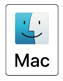
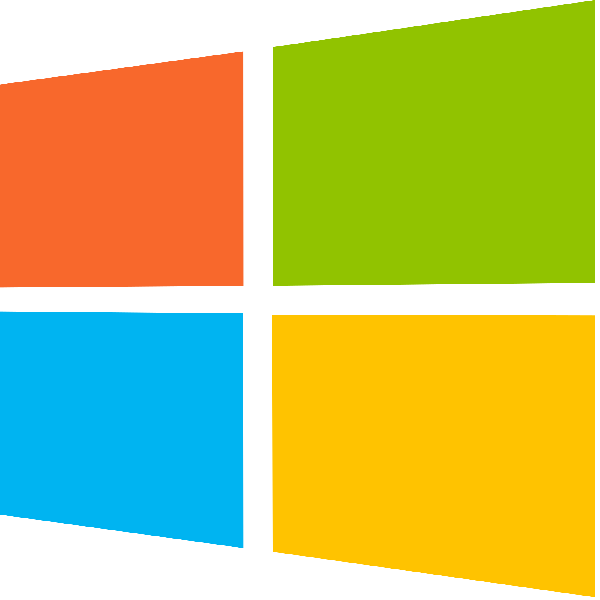

:course_title: FS-01 - Access tools

:course_desc: This course provides the student with the necessary steps to access the required CLIs (command line interface) tools needed to complete the additional courses. <br><br>Access to the tools is via a SSH session connected to a remote server.

:course_max: 1

:button1_label: Task
:button1_size: 500

:button2_label: Hint
:button2_delay: 900000
:button2_color: #e6ffe6
:button2_size: 100

:button3_label: Complete
:button3_delay: 900000
:button3_color: #ffe6b3
:button3_size: 200

:infotab: <hr>

:infotab: <br><br>No additional informaiton has been provided.


:section_1: SSH session

<br>

The objective of this task is to have the student start a SSH session.  The SSH session will connect to a server that will be used for tasks in this course and all other courses.  The target server has the necessary tools installed that are required for these courses.


Press select the link for the desired operating system and follow the instructions. 


[macOs](#macOS_ssh)

[Linux](#Linux_ssh)

[Windows](#windows_ssh)


__Useful information the instructor will provide:__

- IP address - this is the IP address of the student server that will be used.
- TEAM - the team name will be used to access the above server.

<br>
<br>
<br>
<br>
<br>
<br>
<br>
<br>
<br>
<br>
<br>

----

<a name="macOS_ssh"></a>

&nbsp;
### macOS ssh

<br>

1 - Open terminal session on local machine

Using an already installed terminal software start the program.  This should result in a new terminal session on your machine.

<br>

2 - Enter the ssh command:

```

Command:

	ssh <team>@<IP address>

Example output:

	Macbook$ ssh team01@52.117.155.21
	
	team01@52.117.155.21's password:     <<<--- enter team password
	
	Last login: Thu Sep 19 17:48:39 2019 from cpe.res.rr.com

	[team01@server ~]$
	

```

[Select to complete task](#task_complete)

----

<br>
<br>
<br>
<br>
<br>
<br>
<br>
<br>
<br>
<br>

<a name="Linux_ssh"></a>

&nbsp;
### Linux ssh

<br>

1 - Open terminal session on local machine

Using an already installed terminal software start the program.  This should result in a new terminal session on your machine.

<br>

2 - Enter the ssh command:

```

Command:

	ssh <team>@<IP address>

Example output:

	Macbook$ ssh team01@52.117.155.21
	
	team01@52.117.155.21's password:     <<<--- enter team password
	
	Last login: Thu Sep 19 17:48:39 2019 from cpe.res.rr.com

	[team01@server ~]$
	

```

[Select to complete task](#task_complete)

----

<br>
<br>
<br>
<br>
<br>
<br>
<br>
<br>
<br>
<br>

----

<a name="Windows_ssh"></a>

&nbsp;
### Windows ssh


__NOTICE__ These instructions assume that Windows 10 is being used.
 
<br>

1 - Open Power Shell 

Open Power Shell


<br>

2 - Enter the ssh command:

```

Command:

	ssh <team>@<IP address>

Example output:

	PS C:\Users\dave ssh team01@52.117.155.21
	
	team01@52.117.155.21's password:     <<<--- enter team password
	
	Last login: Thu Sep 19 17:48:39 2019 from cpe.res.rr.com

	[team01@server ~]$
	

```

[Select to complete task](#task_complete)

----

<br>
<br>
<br>
<br>
<br>

----
<br>
<br>
<br>
<br>
<br>
<br>
<br>
<br>
<br>
<br>
<br>
<br>
<br>
<br>

<a name="task_complete"></a>

### Task complete

Indicate the task has been completed by pressing the button below.

> ConfirmButton SSH session


:section_2: 
:section_3: 
