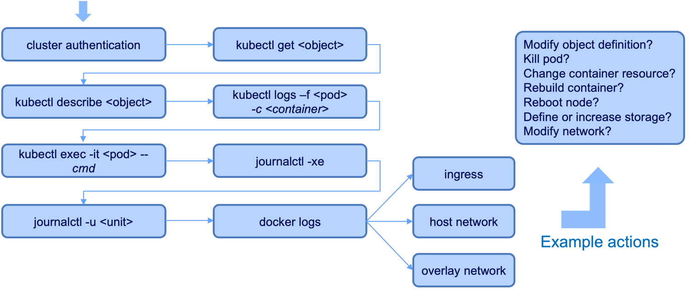

:course_title: FS-03 - Trouble shooting

:course_desc: This course provides the student with the opportunity to trouble shoot multiple problems. <br><br>Once the issue is successfully resolved the running container will report the completion of the lab.  <br><br>No manual process is needed to indicate completion of the task.

:course_auto: yes

:course_auto_links: house=Create,baker=Syntax,carbs=Resources,doors=Images,avail=Security,eagle=Networking,floor=Running,gonzo=Starting,igloo=Readiness,jazzy=NetPolocy,karma=Available,lacey=InitContainer,magma=ConfigSecret,naval=OpenToo,offer=Storage,panda=Stateful,quake=Routes,rainy=Downward,salty=PortForward,truck=Wannbe,under=LollyPop,vicki=WifeName,wally=WontWork

:course_max: 10

:button1_label: Lab
:button1_size: 500
:button1_color: #e6f2ff

:button2_label: Hint
:button2_size: 150
:button2_delay: 3000
:button2_color: #e6ffe6

:button3_label: Step-by-Step
:button3_size: 500
:button3_delay: 10000
:button3_color: #ffe6b3

:infotab: <hr>

:infotab: <br><br>Example debug flow:

:infotab: <br>cmd - command to run

:infotab: <br>container -container name (required if more than one container)

:infotab: <br>object - pods, service, statefulsets, deployment, etc.

:infotab: <br>pod - pod name

:infotab: <br>unit - unit running, e.g. kubelet, docker, etc.


----
----


:section_1: Lab Create

<br>

All references to &#60;team&#62; should be replaced with your team name.

This lab is intended to get the student familar with creating a pod in the team project.  There is no problem to be researched or diagnosis to be performed.  

This lab demonstrates how to deploy a pod.


#### Resources

* K8 yaml - [house.yaml](https://github.com/IBM-ICP-CoC/PyRK8s-Wave2/blob/master/house.yaml)
* Dockerfile - [Dockerfile](https://github.com/IBM-ICP-CoC/PyRK8s-Wave2/blob/master/house_Dockerfile)


#### Useful information

| Item | Value  |
| :--- | :--- |
| cpu:| 50m |
| memory: | 50Mi |
| image: | ibmicpcoc/house:latest |
| ports | none |
| Docker | CMD ["/bin/bash", "-c", "./house.sh"] |

<br>

| Task description  |
| :--- |
| Download the resource K8 yaml file. |
| Edit and save the file after replacing all references of __&#60;team&#62;__ with your team name. |
| Create the K8 objects using oc create |
| Did the pod deploy successfully?  If not, correct the issue and re-create the K8 objects. |

----

:section_2: Hint Create

<br>

To create the pod use the command: __oc create -f &#60;file&#62;;__   (replace &#60;file&#62; with the name of the yaml file you have saved and edited.)


----

:section_3: Step-by-Step Create


#### Diagnosis

No diagnosis is necessary for this lab.  A new pod should be created after editing the yaml file and using the oc create command.


#### Problem discovered

N/A


#### Resolution

Edit the house.yaml file and modify all references of &#60;team&#62; to your team name.

```	

--- #
--- # Course :: Problem Diagnosis and Troubleshooting Lab 
--- 
apiVersion: apps/v1
kind: Deployment
metadata:
  name: <team>-house
  namespace: <team>
  labels:
    app: <team>-house
spec:
  selector:
    matchLabels:
      app: <team>-house
  replicas: 1
  template:
    metadata:
      labels:
        app: <team>-house
    spec:
      containers:
      - name: <team>-house
        image: docker.io/ibmicpcoc/house:latest
        imagePullPolicy: Always
        env:
          - name: APP_NAMESPACE
            valueFrom:
              fieldRef:
                fieldPath: metadata.namespace
          - name: APP_NAME
            valueFrom:
              fieldRef:
                fieldPath: metadata.name
          - name: COLLECTOR_CONFIG
            valueFrom: 
              configMapKeyRef:
                name: <team>-collector-config
                key: COLLECTOR_CONFIG
          - name: INSTRUCTOR_CONFIG
            valueFrom: 
              configMapKeyRef:
                name: <team>-collector-config
                key: INSTRUCTOR_CONFIG
        resources:
          requests:
            cpu: 50m
            memory: 50Mi
---


```

Saved the modified file.

<br>

Create the pod with the modified "house.yaml" file.


```

-- Create --

Command: 
	
	oc create -f house.yaml
	
	
Example output:
	
	deployment.apps/house created


```


Verify the pod deployed successfully.


```	

-- Get --

Command:

	oc get pods -n <team>          # change <team> to your team project


Example output:

	NAME                                 READY     STATUS    RESTARTS   AGE
	team10-house-85976f7b7d-hprtg        1/1       Running   0          3h

	. . .  portions of output removed


```


----
----

:section_1: Lab Resources

<br>

All references to &#60;team&#62; should be replaced with your team name.


#### Resources

* K8 yaml	- [carbs.yaml](https://github.com/IBM-ICP-CoC/PyRK8s-Wave2/blob/master/carbs.yaml)  
* Dockerfile - [Dockerfile](https://github.com/IBM-ICP-CoC/PyRK8s-Wave2/blob/master/carbs_Dockerfile)  


#### Useful information

| Item | Value  |
| :--- | :--- |
| spec.template.spec.containers[*].resouces.request.cpu| 100m |
| spec.template.spec.containers[*].resouces.request.memory: | 100Mi |
| spec.template.spec.containers[*].image: | ibmicpcoc/carbs:latest |
| spec.template.spec.containers[*].ports | none |
| Docker CMD | ["/bin/bash", "-c", "./carbs.sh"] |

<br>

| Task description  |
| :--- |
| Within your team project diagnose the pod that begins with __&#60;team&#62; -carbs__|
| Download the resource K8 yaml file. |
| Edit and save the file after replacing all references of &#60;team&#62; with your team name. |
| Create the K8 objects. |
| Did the pod deploy successfully?  If not, correct the issue and re-create the K8 objects. |

----

:section_2: Hint Resources

<br>

* Describe the pod.

* You can get all events from the namespace by using, oc get events -n __&#60;team&#62;__

* A single cpu is defined with 1000m. The container cpu resources should use __1/10__ of a cpu.  

* Editing a running pod is another method to change the pod.  Use the command:

```
OC_EDITOR="nano" oc edit deployment/<team>-carbs   <<<--- replace <team> with team name  
```

Nano is the editor defined in the above command.  By removing the OC_EDITOR="nano" parameter the default editor on your machine will be opened.


----

:section_3: Step-by-Step Resources


#### Diagnosis

When attempting to deploy the pod the yaml file is not properly defined.

Check the Pod status

```	

-- Get --

Command:
	
	oc get pods 
	

Example output:

	NAME                              READY     STATUS    RESTARTS   AGE
	team01-carbs-5c96bc649-tjnhb       0/1       Pending   0          2m
	
```

Describe the pod

```

-- Describe --

Command:

	oc describe po team01-carbs-5c96bc649-tjnhb
	
	
Example output:	

	Name:               team01-carbs-5c96bc649-tjnhb
	Namespace:          team01
	Priority:           0
	PriorityClassName:  <none>
	Node:               <none>
	Labels:             app=team01-carbs
	                    pod-template-hash=175267205
	Annotations:        kubernetes.io/psp=ibm-privileged-psp
	Status:             Pending
	IP:
	Controlled By:      ReplicaSet/team01-carbs-5c96bc649
	Containers:
	  team01-carbs:
	    Image:      ibmicpcoc/carbs:latest
	    Port:       <none>
	    Host Port:  <none>
	    Requests:
	      cpu:     25
	      memory:  100Mi
	    Environment:
	      APP_NAMESPACE:      team01 (v1:metadata.namespace)
	      APP_NAME:           team01-carbs-5c96bc649-tjnhb (v1:metadata.name)
	      COLLECTOR_CONFIG:   <set to the key 'COLLECTOR_CONFIG' of config map 'team01-collector-config'>   Optional: false
	      INSTRUCTOR_CONFIG:  <set to the key 'INSTRUCTOR_CONFIG' of config map 'team01-collector-config'>  Optional: false
	    Mounts:
	      /var/run/secrets/kubernetes.io/serviceaccount from default-token-mq64m (ro)
	Conditions:
	  Type           Status
	  PodScheduled   False
	Volumes:
	  default-token-mq64m:
	    Type:        Secret (a volume populated by a Secret)
	    SecretName:  default-token-mq64m
	    Optional:    false
	QoS Class:       Burstable
	Node-Selectors:  <none>
	Tolerations:     node.kubernetes.io/memory-pressure:NoSchedule
	                 node.kubernetes.io/not-ready:NoExecute for 300s
	                 node.kubernetes.io/unreachable:NoExecute for 300s
	Events:
	  Type     Reason            Age                 From               Message
	  ----     ------            ----                ----               -------
	  Warning  FailedScheduling  58s (x121 over 5m)  default-scheduler  0/3 nodes are available: 3 Insufficient cpu.
	  
```

	
In the "Events" section review the "Message" from the entry with "Type" Warning and "Reason" FailedScheduling


```
	0/3 nodes are available: 3 Insufficient cpu.

```

<br>

Example of Get Events in namespace

```

-- Get Events --

Command:
	
	oc get events -n <team>
	
	
Example output:

	LAST SEEN   FIRST SEEN   COUNT     NAME                                            KIND         SUBOBJECT                      TYPE      REASON              SOURCE                    MESSAGE
	7m          7m           1         team01-carbs.157be1efb7ad1a77                    Deployment                                  Normal    ScalingReplicaSet   deployment-controller     Scaled up replica set team01-carbs-5c96bc649 to 1
	7m          7m           1         team01-carbs-5c96bc649.157be1efb85494ba          ReplicaSet                                  Normal    SuccessfulCreate    replicaset-controller     Created pod: team01-carbs-5c96bc649-tjnhb
	2m          7m           121       team01-carbs-5c96bc649-tjnhb.157be1efb858b4b3    Pod                                         Warning   FailedScheduling    default-scheduler         0/4 nodes are available: 4 Insufficient cpu.
	  
	  

```


<br>


####  Problem discovered
	
Events output indicates the pod is FailedScheduling because there are not enough CPU resources available.

<br>


#### Resolution

Multiple methods exist to correct the issue, below are two options. 

> The first method is deleting the old pod, edit the yaml file, and re-create the pod.  
 
Edit the carbs.yaml file and modify <i>cpu</i> to decrease the amount of cpu to 10% of a single CPU.


Delete the running pod.


```

-- Delete --

Command:  
	
	oc delete -f carbs.yaml
		
Example output:

	deployment.apps "carbs" deleted


```


<br>

Example of the edited file carbs.yaml (only a portion of file shown below)

```

	spec:
	  selector:
	    matchLabels:
         app: <team>-carbs
     replicas: 1
     template:
       metadata:
         labels:
           app: <team>-carbs
       spec:
         containers:
         - name: <team>-carbs
           image: ibmicpcoc/carbs:latest
           resources:
             requests:
               cpu: 25000m                   <=== change value to 100m
               memory: 100Mi
               
```


<br>

Create the deployment using the modified __carbs.yaml__ file.

```	

-- Create --

Command:
	
	oc create -f carbs.yaml
	

Example output:

	deployment.apps/<team>-carbs created.   <<<--- <team> will be replaced with team name


```

<br>

> The second method shown is editing the running pod.  


Edit the running pod.  The kubernetes object content is available in the editor (shown below).  Note the content has both the spec: and status: sections. 

Locate the line cpu: "25" and change the line to cpu: 100m (without quotes)


```	

-- Edit --

Command:  
	
	OC_EDITOR="nano" oc edit deployment/<team>-carbs     # replace <team> 

Content shown when editor is open.  The team01-carbs deployment is being shown:

# Please edit the object below. Lines beginning with a '#' will be ignored,
# and an empty file will abort the edit. If an error occurs while saving this file will be
# reopened with the relevant failures.
#
apiVersion: extensions/v1beta1
kind: Deployment
metadata:
  annotations:
    deployment.kubernetes.io/revision: "1"
  creationTimestamp: 2019-01-21T14:01:56Z
  generation: 1
  labels:
    app: team01-carbs
  name: team01-carbs
  namespace: team01
  resourceVersion: "5834141"
  selfLink: /apis/extensions/v1beta1/namespaces/team01/deployments/team01-carbs
  uid: 1d02fbe9-1d85-11e9-b012-06ed6a534df5
spec:
  progressDeadlineSeconds: 600
  replicas: 1
  revisionHistoryLimit: 10
  selector:
    matchLabels:
      app: team01-carbs
  strategy:
    rollingUpdate:
      maxSurge: 25%
      maxUnavailable: 25%
    type: RollingUpdate
  template:
    metadata:
      creationTimestamp: null
      labels:
        app: team01-carbs
    spec:
      containers:
      - env:
        - name: APP_NAMESPACE
          valueFrom:
            fieldRef:
              apiVersion: v1
              fieldPath: metadata.namespace
        - name: APP_NAME
          valueFrom:
            fieldRef:
              apiVersion: v1
              fieldPath: metadata.name
        - name: COLLECTOR_CONFIG
          valueFrom:
            configMapKeyRef:
              key: COLLECTOR_CONFIG
              name: team01-collector-config
        - name: INSTRUCTOR_CONFIG
          valueFrom:
            configMapKeyRef:
              key: INSTRUCTOR_CONFIG
              name: team01-collector-config
        image: ibmicpcoc/carbs:latest
        imagePullPolicy: Always
        name: team01-carbs
        resources:
          requests:
            cpu: "25"                         <=== change value to 100m without quotes
            memory: 100Mi
        terminationMessagePath: /dev/termination-log
        terminationMessagePolicy: File
      dnsPolicy: ClusterFirst
      restartPolicy: Always
      schedulerName: default-scheduler
      securityContext: {}
      terminationGracePeriodSeconds: 30
status:
  conditions:
  - lastTransitionTime: 2019-01-21T14:01:56Z
    lastUpdateTime: 2019-01-21T14:01:56Z
    message: Deployment does not have minimum availability.
    reason: MinimumReplicasUnavailable
    status: "False"
    type: Available
  - lastTransitionTime: 2019-01-21T14:11:57Z
    lastUpdateTime: 2019-01-21T14:11:57Z
    message: ReplicaSet "team01-carbs-5c96bc649" has timed out progressing.
    reason: ProgressDeadlineExceeded
    status: "False"
    type: Progressing
  observedGeneration: 1
  replicas: 1	


NOTE: You must save the file for the changes to take effect.


Example output:
	deployment.extensions/team01-carbs edited
	

```

Did this resolve the issue?


```

-- Get --

Command: 
	
	oc get pods


Example output:
	
	NAME                              READY     STATUS    RESTARTS   AGE
	team01-carbs-7784b95958-pctl5      1/1       Running   0          2m


```
	


----
----

:section_1: Lab Images

<br>

All references to &#60;team&#62; should be replaced with your team name.


#### Resources

* K8 yaml	- [doors.yaml](https://github.com/IBM-ICP-CoC/PyRK8s-Wave2/blob/master/doors.yaml)
* Dockerfile - [Dockerfile](https://github.com/IBM-ICP-CoC/PyRK8s-Wave2/blob/master/doors_Dockerfile)


#### Useful information

| Item | Value  |
| :--- | :--- |
| cpu:| 50m |
| memory: | 50Mi |
| image: | ibmicpcoc/doors:latest |
| ports | none |
| Docker | CMD ["node", "app.js"] |
 
<br>

| Task description  |
| :--- |
| Within your team project diagnose the pod that begins with &#60;team&#62;-doors|
| Download the resource K8 yaml file. |
| Use either of the delete-create-pod or edit-running-pod approaches to resolve the issue. |
| Did the pod deploy successfully?  If not, correct the issue and re-create the K8 objects. |


----

:section_2: Hint Images

<br>

Check the "tag" of the image that is being pulled. 


----

:section_3: Step-by-Step Images


#### Diagnosis

Describe the pod.

```

-- Get --
	
Command:
	
	oc get pods 
	

Example output:
	
	NAME                         READY     STATUS             RESTARTS   AGE
	team01-doors-78b7f6598d-p8kvf   0/1       ImagePullBackOff   0          10m


-- Describe --

Command: 

	oc describe po team01-doors-78b7f6598d-p8kvf
	
	
Example output:

	Name:               team01-doors-78b7f6598d-p8kvf
	Namespace:          team01
	Priority:           0
	PriorityClassName:  <none>
	Node:               10.186.56.85/10.186.56.85
	Start Time:         Mon, 21 Jan 2019 10:18:18 -0600
	Labels:             app=team01-doors
	                    pod-template-hash=3349118043
	. . .
			portions of output removed
	. . .
	
	Events:
	  Type     Reason     Age                From                   Message
	  ----     ------     ----               ----                   -------
	  Normal   Scheduled  46s                default-scheduler      Successfully assigned team01/team01-doors-78b7f6598d-p8kvf to 10.186.56.85
	  Normal   Pulling    28s (x2 over 43s)  kubelet, 10.186.56.85  pulling image "ibmicpcoc/doors:last"
	  Warning  Failed     27s (x2 over 43s)  kubelet, 10.186.56.85  Failed to pull image "ibmicpcoc/doors:last": rpc error: code = Unknown desc = Error response from daemon: manifest for ibmicpcoc/doors:last not found
	  Warning  Failed     27s (x2 over 43s)  kubelet, 10.186.56.85  Error: ErrImagePull
	  Normal   BackOff    12s (x3 over 42s)  kubelet, 10.186.56.85  Back-off pulling image "ibmicpcoc/doors:last"
	  Warning  Failed     12s (x3 over 42s)  kubelet, 10.186.56.85  Error: ImagePullBackOff


```

Multiple Warning messages are displayed in the Events section.  Review all of the Warning messages.
	
In the "Events" section review the "Message" from the entry with "Type" Warning and "Reason" Failed
<br>

```

...  Failed to pull image "ibmicpcoc/doors:last": rpc error: code = Unknown desc = Error response from daemon: manifest for ibmicpcoc/doors:last not found

(output is from the first Failed message)

```

<br>


####  Problem discovered
	
The image cannot be located as indicated by the "Failed to pull image" message.  The image tag last on the container is incorrect.  The image tag should be latest.


<br>


#### Resolution

The edit-running-pod is shown in the following example to resolve the issue:

```

-- Edit --

Command to edit the running pod:

	OC_EDITOR="nano" oc -n <team> edit deployment/<team>-doors


Example editor content:  (modify the tag of the image to "latest")
	
	
	# Please edit the object below. Lines beginning with a '#' will be ignored,
	# and an empty file will abort the edit. If an error occurs while saving this file will be
	# reopened with the relevant failures.
	#
	apiVersion: extensions/v1beta1
	kind: Deployment
	metadata:
	  annotations:
	    deployment.kubernetes.io/revision: "1"
	  creationTimestamp: 2019-01-21T16:18:18Z
	  generation: 1
	  labels:
	    app: team01-doors
	  name: team01-doors
	  namespace: team01
	  resourceVersion: "5853628"
	  selfLink: /apis/extensions/v1beta1/namespaces/team01/deployments/team01-doors
	  uid: 29914949-1d98-11e9-b012-06ed6a534df5
	spec:
	  progressDeadlineSeconds: 600
	  replicas: 1
	  revisionHistoryLimit: 10
	  selector:
	    matchLabels:
	      app: team01-doors
	  strategy:
	    rollingUpdate:
	      maxSurge: 25%
	      maxUnavailable: 25%
	    type: RollingUpdate
	  template:
	    metadata:
	      creationTimestamp: null
	      labels:
	        app: team01-doors
	    spec:
	      containers:
	      - env:
	        - name: APP_NAMESPACE
	          valueFrom:
	            fieldRef:
	              apiVersion: v1
	              fieldPath: metadata.namespace
	        - name: APP_NAME
	          valueFrom:
	            fieldRef:
	              apiVersion: v1
	              fieldPath: metadata.name
	        - name: COLLECTOR_CONFIG
	          valueFrom:
	            configMapKeyRef:
	              key: COLLECTOR_CONFIG
	              name: team01-collector-config
	        - name: INSTRUCTOR_CONFIG
	          valueFrom:
	            configMapKeyRef:
	              key: INSTRUCTOR_CONFIG
	              name: team01-collector-config
	        image: ibmicpcoc/doors:last             <=== change the :last to :latest
	        imagePullPolicy: Always

. . . additional content not shown 


Ensure you have save the modified file.


Example output:

	deployment/team01-doors


```

<br>

Validate the pod status is Running.

```

-- Get --

Command:
	
	oc get pods
		

Example output:
	
	NAME                              READY     STATUS    RESTARTS   AGE
	team01-doors-767f49c748-6gvcg       1/1       Running   0          1m


```


----
----

:section_1: Lab Networking

<br>

All references to &#60;team&#62; should be replaced with your team name.

#### Resources

* K8 yaml	- [eagle.yaml](https://github.com/IBM-ICP-CoC/PyRK8s-Wave2/blob/master/eagle.yaml)
* Dockerfile - [Dockerfile](https://github.com/IBM-ICP-CoC/PyRK8s-Wave2/blob/master/eagle_Dockerfile)


#### Useful information

| Item | Value  |
| :--- | :--- |
| cpu:| 50m |
| memory: | 50Mi |
| image: | ibmicpcoc/eagle:latest |
| ports | 4100 |
| Docker | CMD ["node", "server.js"] |

<br>

| Task description  |
| :--- |
| This lab uses the pod with a name that starts with __&#60;team&#62;-eagle__ |
| The web application is not working properly. The application is has a K8 Deployment and Service defined. |
| Research why the web application is not working properly. |
| Once you have resolved the issue locate the NodePort (is a number in the 30000 range) for the service.  Example: oc get svc -n &#60;team&#62; -o wide|
| Using the same IP that has been used to access the Collector now access the web application using the newly located node port number.  Example URL to access web application:  __http://xxx.xxx.xxx.xxx:NodePort__ 
| Once the web application is successfully accessed press the button to complete the lab.|


__NOTICE:  The last step must be completed to mark the lab complete in the Instructor UI.__

<br>


----

:section_2: Hint Networking

<br>

* Deployment and Service port definitions must match.  

* What port should the application be available on?  Refer to __Useful Information__.

----


:section_3: Step-by-Step Networking


#### Diagnosis

The pod is running successfully yet describing the pod can provide information about the configured K8 objects.  Describe the pod that begins with: &#60;team&#62;-eagle


```

-- Get pods –-

Command:

	oc get po              


Example output:

	NAME                                 READY     STATUS    RESTARTS   AGE
	team10-eagle-56dcf97b6b-msjwt        1/1       Running   0          40s


-- Describe pod --

Command:                  # Use the pod name from the previous output

	oc describe po team10-eagle-56dcf97b6b-msjwt


Example output:

	Name:               team10-eagle-56dcf97b6b-msjwt
	Namespace:          team10
	Priority:           0
	PriorityClassName:  <none>
	Node:               pysyd.159.23.66.104.nip.io/159.23.66.104
	Start Time:         Sat, 28 Sep 2019 18:39:25 +1000
	Labels:             app=team10-eagle
	                    pod-template-hash=1287953626
	Annotations:        openshift.io/scc=restricted
	Status:             Running
	IP:                 10.129.0.173
	Controlled By:      ReplicaSet/team10-eagle-56dcf97b6b
	Containers:
	  team10-eagle:
	    Container ID:   docker://05e5e2f6ff0ad45fc5c913953a3442553792848e02bb6401e2bc4f40eb132267
	    Image:          docker.io/ibmicpcoc/eagle:latest
	    Image ID:       docker-pullable://docker.io/ibmicpcoc/eagle@sha256:9868019eda5069768539f8b765025caf18d65734d9f6164512332dfbbdf630eb
	    Port:           4100/TCP
	    Host Port:      0/TCP
	    State:          Running
	      Started:      Sat, 28 Sep 2019 18:39:37 +1000
	    Ready:          True
	    Restart Count:  0
	    Requests:
	      cpu:     50m
	      memory:  50Mi
	    Environment:
	      APP_NAMESPACE:      team10 (v1:metadata.namespace)
	      APP_NAME:           team10-eagle-56dcf97b6b-msjwt (v1:metadata.name)
	      COLLECTOR_CONFIG:   <set to the key 'COLLECTOR_CONFIG' of config map 'team10-collector-config'>   Optional: false
	      INSTRUCTOR_CONFIG:  <set to the key 'INSTRUCTOR_CONFIG' of config map 'team10-collector-config'>  Optional: false
	    Mounts:
	      /var/run/secrets/kubernetes.io/serviceaccount from default-token-kcr98 (ro)
	Conditions:
	  Type              Status
	  Initialized       True
	  Ready             True
	  ContainersReady   True
	  PodScheduled      True
	Volumes:
	  default-token-kcr98:
	    Type:        Secret (a volume populated by a Secret)
	    SecretName:  default-token-kcr98
	    Optional:    false
	QoS Class:       Burstable
	Node-Selectors:  node-role.kubernetes.io/compute=true
	Tolerations:     node.kubernetes.io/memory-pressure:NoSchedule
	Events:
	  Type    Reason     Age   From                                 Message
	  ----    ------     ----  ----                                 -------
	  Normal  Scheduled  48s   default-scheduler                    Successfully assigned team10/team10-eagle-56dcf97b6b-msjwt to pysyd.159.23.66.104.nip.io
	  Normal  Pulling    44s   kubelet, pysyd.159.23.66.104.nip.io  pulling image "docker.io/ibmicpcoc/eagle:latest"
	  Normal  Pulled     35s   kubelet, pysyd.159.23.66.104.nip.io  Successfully pulled image "docker.io/ibmicpcoc/eagle:latest"
	  Normal  Created    35s   kubelet, pysyd.159.23.66.104.nip.io  Created container
	  Normal  Started    35s   kubelet, pysyd.159.23.66.104.nip.io  Started container

```

Review the port definitions from the describe output.


Describe the service defined for this pod.


```

-- Get Services --

Command:

	oc get svc


Example output:


	NAME                TYPE       CLUSTER-IP       EXTERNAL-IP   PORT(S)        AGE
	team10-eagle        NodePort   172.30.100.2     <none>        80:31024/TCP   1h
	team10-igloo        NodePort   172.30.224.252   <none>        80:30814/TCP   2h
	team10-jazzy        NodePort   172.30.217.79    <none>        80:30092/TCP   1h
	team10-quake        NodePort   172.30.69.77     <none>        80:30836/TCP   3h
	team10-salty        NodePort   172.30.174.1     <none>        80:30624/TCP   2h
	team10-student-ui   NodePort   172.30.89.80     <none>        80:31010/TCP   1d


-- Describe service --

Command:

	oc describe svc team10-eagle


Example outpot:


	Name:                     team10-eagle
	Namespace:                team10
	Labels:                   app=team10-eagle
	Annotations:              <none>
	Selector:                 app=team10-eagle
	Type:                     NodePort
	IP:                       172.30.225.217
	Port:                     team10-eagle  80/TCP
	TargetPort:               4010/TCP
	NodePort:                 team10-eagle  32308/TCP
	Endpoints:                10.129.0.173:4010
	Session Affinity:         None
	External Traffic Policy:  Cluster
	Events:                   <none>


```


####  Problem discovered
	
The ports do not match for the Deployment and Service definitions.  The values are 4100 and 4010.


#### Resolution

Edit the Service definition and change the port from 4010 to 4100.


__NOTE: Complete this lab by accessing the URL and pressing the button shown in the browser with the value 'Click to complete lab!'.__


Example URL using the master IP and the node port from the service definition after fixing the above issue.

```
	http://159.23.66.107:31024/
```


----
----

:section_1: Lab Running 

<br>

All references to &#60;team&#62; should be replaced with your team name.


#### Resources

* K8 yaml	- [floor.yaml](https://github.com/IBM-ICP-CoC/PyRK8s-Wave2/blob/master/floor.yaml)
* Dockerfile - [Dockerfile](https://github.com/IBM-ICP-CoC/PyRK8s-Wave2/blob/master/floor_Dockerfile)


#### Useful information

| Item | Value  |
| :--- | :--- |
| cpu:| 50m |
| memory: | 50Mi |
| image: | ibmicpcoc/floor:latest |
| ports | none |
| YAML | command: ["node", "app.js"] |

<br>

| Task description  |
| :--- |
| A container within a successfully deployed pod is not working properly.  Research the running container to diagnose the issue.  |
| View the logs of the running container. |
| Correct the issue inside the running container. |


----

:section_2: Hint Running

<br>

* Exec into the running container
* Use touch, nano, or echo with piping to assist in resolving the issue

----

:section_3: Step-by-Step Running


#### Diagnosis

Check the logs of the running container that begins with &#60;team&#62;

```

-- Get --

Command :

	oc get pods                 

	

Example output:

	NAME                              READY     STATUS    RESTARTS   AGE
	team01-floor-6ff9f54f44-zpchp       1/1       Running   0          41s


-- Logs --

Command:
	oc logs -f team01-floor-6ff9f54f44-zpchp            
	

Example output:

	Note the instructions from viewing the log
	
	1/21/2019, 10:21:14 PM :: clnt012i - Check for file: /app/team.txt check count: 43
	1/21/2019, 10:21:14 PM :: clnt013i - The file team.txt in the /app directory must exist for this lab to be completed.
	1/21/2019, 10:21:14 PM :: clnt014i - Create the file in the running container.


```


####  Problem discovered
	
The file team.txt is missing from the /app directory in the running container.


#### Resolution

Here are two methods that can be used to resolve the creating of the file.  

> First method is to run a "command" using the oc CLI from outside the container.

<br>

```

-- Get --

Command to get pods in namespace

	oc get po
	
	
Example output:
	
	NAME                              READY     STATUS    RESTARTS   AGE
	team01-floor-6ff9f54f44-zpchp       1/1       Running   0          41s


```

Add the team.txt file using the touch command from outside the container.
	
```

-- Exec --

Command:

	oc exec -n team01 team01-floor-6ff9f54f44-zpchp -- sh -c "touch /app/team.txt"

	The above command is using 'sh'.  
	
	
	
Example output:  (wait a few seconds for the messages to show)

	1/21/2019, 10:25:30 PM :: clnt014i - Create the file in the running container.
	1/21/2019, 10:25:45 PM :: ----------------------------------------------------------------------------------
	1/21/2019, 10:25:45 PM :: clnt008i - File located.  Reporting to collector.
	1/21/2019, 10:25:45 PM :: ----------------------------------------------------------------------------------
	1/21/2019, 10:25:45 PM :: clnt007i - Student count: 61 from /team01/team01-floor-6ff9f54f44-zpchp
	1/21/2019, 10:25:45 PM :: clnt010i - Instructor count: 1 from /team01/team01-floor-6ff9f54f44-
	
	The clnt007i and clnt010i messages are produced once the file has been located.


```


<br>

> Second method is to exec into the running container and create the file from a shell prompt.  This method requires 'sh' capability must be installed in the container for this to work.

<br>

```

-- Get --

Command to get pods in namespace

	oc get po


Example output from "team01" namespace	

	NAME                              READY     STATUS    RESTARTS   AGE
	team01-floor-6ff9f54f44-zpchp       1/1       Running   0          41s


-- Exec to open a terminal session with the running container --

Command:
	
	oc exec -it team01-floor-6ff9f54f44-zpchp -- sh

	Note: The above command is using 'sh'.  The 'sh' capability must be installed in the container for this to work.


	
Example result output:

	/app #
	


-- Create the file using touch --

Command:

	touch team.txt                   
	
	Notice the "/app" directory is not included as part of the touch command since the prompt is open to that directory.
	


Example output:  (wait a few seconds for the messages to show)

	1/21/2019, 10:25:30 PM :: clnt014i - Create the file in the running container.
	1/21/2019, 10:25:45 PM :: ----------------------------------------------------------------------------------
	1/21/2019, 10:25:45 PM :: clnt008i - File located.  Reporting to collector.
	1/21/2019, 10:25:45 PM :: ----------------------------------------------------------------------------------
	1/21/2019, 10:25:45 PM :: clnt007i - Student count: 61 from /team01/team01-floor-6ff9f54f44-zpchp
	1/21/2019, 10:25:45 PM :: clnt010i - Instructor count: 1 from /team01/team01-floor-6ff9f54f44-
	
	The clnt007i and clnt010i messages are produced once the file has been located.


```


----
----

:section_1: Lab Starting

<br>

All references to &#60;team&#62; should be replaced with your team name.


#### Resources

* K8 yaml	- [gonzo.yaml](https://github.com/IBM-ICP-CoC/PyRK8s-Wave2/blob/master/gonzo.yaml)
* Dockerfile - [Dockerfile](https://github.com/IBM-ICP-CoC/PyRK8s-Wave2/blob/master/gonzo_Dockerfile)


#### Useful information

| Item | Value  |
| :--- | :--- |
| cpu:| 50m |
| memory: | 50Mi |
| image: | ibmicpcoc/gonzo:latest |
| ports | none |
| YAML | command: ["/bin/bash", "-c", "/app/app.sh gonzo"] |
        
----

| Task description  |
| :--- |
| A pod that begins with &#60;team&#62;-gonzo is failing creation.  |
| Research the issue to determine what is causing the failure. |
| Edit the gonzo.yaml file to correct the issue. |
| Verify the deployment successfully deployed |

----


:section_2: Hint Starting

<br>

* What ENTRYPOINT or CMD is defined for the Docker image?
* What container "command" parameter is defined for the pod definition?
* Command: docker history ibmicpcoc/gonzo --no-trunc can also be used to check the docker image.
* The gonzo.yaml must be modified to correct the issue.  You will not be allowed to rebuild or modify the Docker image.

----

:section_3: Step-by-Step Starting


#### Diagnosis

```

-- Get --

Command:

	oc get po


	
Example output:

	NAME                              READY     STATUS             RESTARTS   AGE
	team01-gonzo-75d79787b7-88pnr       0/1       CrashLoopBackOff   4          2m


-- Describe --

Command:

	oc describe pod team01-gonzo-75d79787b7-88pnr 


Example output:

	Name:               team01-gonzo-75d79787b7-88pnr
	Namespace:          team01
	Priority:           0
	PriorityClassName:  <none>
	Node:               10.186.56.85/10.186.56.85
	Start Time:         Mon, 21 Jan 2019 18:13:15 -0600
	Labels:             app=team01-gonzo
	                    pod-template-hash=3183534363
	. . .
			portions of output removed
	. . .
	
	Conditions:
	  Type              Status
	  Initialized       True
	  Ready             False
	  ContainersReady   False
	  PodScheduled      True
	Volumes:
	  default-token-mq64m:
	    Type:        Secret (a volume populated by a Secret)
	    SecretName:  default-token-mq64m
	    Optional:    false
	QoS Class:       Burstable
	Node-Selectors:  <none>
	Tolerations:     node.kubernetes.io/memory-pressure:NoSchedule
	                 node.kubernetes.io/not-ready:NoExecute for 300s
	                 node.kubernetes.io/unreachable:NoExecute for 300s
	Events:
	  Type     Reason     Age                 From                   Message
	  ----     ------     ----                ----                   -------
	  Normal   Scheduled  11m                 default-scheduler      Successfully assigned team01/team01-gonzo-75d79787b7-88pnr to 10.186.56.85
	  Normal   Created    10m (x4 over 11m)   kubelet, 10.186.56.85  Created container
	  Normal   Started    10m (x4 over 11m)   kubelet, 10.186.56.85  Started container
	  Normal   Pulling    9m (x5 over 11m)    kubelet, 10.186.56.85  pulling image "ibmicpcoc/gonzo:latest"
	  Normal   Pulled     9m (x5 over 11m)    kubelet, 10.186.56.85  Successfully pulled image "ibmicpcoc/gonzo:latest"
	  Warning  BackOff    58s (x46 over 11m)  kubelet, 10.186.56.85  Back-off restarting failed container                
		
	
```
	
In the "Events" section review the "Message" from the entry with "Type" Warning and "Reason" BackOff
<br>

```
... Back-off restarting failed container
```

Check the image for the command or entrypoint defined to execute when the container is created


* Review the Dockerfile provided in the Resources section of this lab.

* Browse the Dockerfile and review the entrypoint or command defined to start when container is created.
	
(or)	

* Check the Docker image using the following command:

```
	docker history ibmicpcoc/gonzo --no-trunc 	
```


####  Problem discovered
	
The container is ending as soon as it starts.  The entrypoint or command that executes when the container starts is not defined in either the Dockerfile or gonzo.yaml file.  


#### Resolution

Add the "command" parameter to the pod container definition using the file gonzo.yaml provided in the Resources section of this lab.  The "command" parameter should define the bash script /app/gonzo.sh using /bin/bash


```
Example parameter:

	command: ["/bin/bash", "-c", "/app/gonzo.sh"]

```

Add the "command" parameter to the container.  


```

-- Example of of the modified yaml file --

apiVersion: apps/v1
kind: Deployment
metadata:
  name: team01-gonzo
  namespace: team01
  labels:
    app: team01-gonzo
spec:
  selector:
    matchLabels:
      app: team01-gonzo
  replicas: 1
  template:
    metadata:
      labels:
        app: team01-gonzo
    spec:
      containers:
      - name: team01-gonzo
        image: ibmicpcoc/gonzo:latest
        imagePullPolicy: Always
        command: ["/bin/bash", "-c", "/app/gonzo.sh"]    <=== inserted this line

. . .  reaminder of file not shown . . .


```


Re-deploy the pod and verify the pod is running.  There will be no visible log messages so the __oc describe__ command must be used for validation.


----
----
:section_1: Lab Liveness

<br>

All references to &#60;team&#62; should be replaced with your team name.


#### Resources

* K8 yaml	- [igloo.yaml](https://github.com/IBM-ICP-CoC/PyRK8s-Wave2/blob/master/igloo.yaml)
* Dockerfile - [Dockerfile](https://github.com/IBM-ICP-CoC/PyRK8s-Wave2/blob/master/igloo_Dockerfile)


#### Useful information

| Item | Value  |
| :--- | :--- |
| Misc | Readiness and Liveness probes defined | 
        
<br>

| Task description  |
| :--- |
| A pod that begins with &#60;team&#62;-igloo is frequently restarting.  |
| Research the issue to determine what is causing the pod to restart frequently. |
| Review the pod log to determine how long the http server waits to be started. |
| Edit the igloo.yaml file to correct the issue. |
| Verify the deployment successfully deployed. |

<br>

__The target url must be accessed to mark this task complete.__


Once issue is successfully resolved perform the following.


* Get the NodePort for the &#60;team&#62;-igloo service.
* Get the IP address for the master node.
* Using the above NodePort and the master IP address access the url: http://<master ip>:<NodePort> to mark the task as complete.


----


:section_2: Hint Liveness

<br>

* How long do both probes delay before starting?

----

:section_3: Step-by-Step Liveness


#### Diagnosis

```

-- Get pods --

Command: 

	oc -n <team> get pods                 <=== Replace <team>
	
	(if in team project already)
	
	oc get po


Example output:

   NAME                         READY     STATUS    RESTARTS   AGE
   team20-igloo-7b85976d87-x6z6r   0/1       Running   3          2m
   


-- Describe --

Command:

	oc describe po team20-igloo-7b85976d87-x6z6r


	
Example output:	
	
	Name:               team20-igloo-7b85976d87-x6z6r
	Namespace:          team20
	Priority:           0
	PriorityClassName:  <none>
	Node:               gfstst.169.62.225.201.nip.io/169.62.225.201
	Start Time:         Tue, 03 Sep 2019 20:06:13 -0400
	Labels:             app=team20-igloo
	                    pod-template-hash=3641532843
	Annotations:        openshift.io/scc=restricted
	Status:             Running
	IP:                 10.129.0.94
	Controlled By:      ReplicaSet/team20-igloo-7b85976d87
	Containers:
	  team20-igloo:
	    Container ID:   docker://e9b6049395fa281c1ca0d6e63001ac3226fc211c5948bf1673023c9dc6f74f37
	    Image:          ibmicpcoc/igloo:latest
	    Image ID:       docker-pullable://docker.io/ibmicpcoc/igloo@sha256:4968f5c1ca641e3267d9a163c68eceb307973e06a30df51a47d86dcd0e301a40
	    Port:           <none>
	    Host Port:      <none>
	    State:          Running
	      Started:      Tue, 03 Sep 2019 20:06:49 -0400
	    Last State:     Terminated
	      Reason:       Error
	      Exit Code:    137
	      Started:      Tue, 03 Sep 2019 20:06:16 -0400
	      Finished:     Tue, 03 Sep 2019 20:06:48 -0400
	    Ready:          False
	    Restart Count:  1
	    Requests:
	      cpu:      50m
	      memory:   50Mi
	    Liveness:   http-get http://:4100/health delay=1s timeout=1s period=2s #success=1 #failure=1
	    Readiness:  http-get http://:4100/ready delay=1s timeout=1s period=5s #success=1 #failure=3
	    Environment:
	      APP_NAMESPACE:      team20 (v1:metadata.namespace)
	      APP_NAME:           team20-igloo-7b85976d87-x6z6r (v1:metadata.name)
	      COLLECTOR_CONFIG:   <set to the key 'COLLECTOR_CONFIG' of config map 'team20-collector-config'>   Optional: false
	      INSTRUCTOR_CONFIG:  <set to the key 'INSTRUCTOR_CONFIG' of config map 'team20-collector-config'>  Optional: false
	    Mounts:
	      /var/run/secrets/kubernetes.io/serviceaccount from default-token-dxnzt (ro)
	Conditions:
	  Type              Status
	  Initialized       True
	  Ready             False
	  ContainersReady   False
	  PodScheduled      True
	Volumes:
	  default-token-dxnzt:
	    Type:        Secret (a volume populated by a Secret)
	    SecretName:  default-token-dxnzt
	    Optional:    false
	QoS Class:       Burstable
	Node-Selectors:  node-role.kubernetes.io/compute=true
	Tolerations:     node.kubernetes.io/memory-pressure:NoSchedule
	Events:
	  Type     Reason     Age               From                                   Message
	  ----     ------     ----              ----                                   -------
	  Normal   Scheduled  42s               default-scheduler                      Successfully assigned team20/team20-igloo-7b85976d87-x6z6r to gfstst.169.62.225.201.nip.io
	  Normal   Pulling    7s (x2 over 40s)  kubelet, gfstst.169.62.225.201.nip.io  pulling image "ibmicpcoc/igloo:latest"
	  Normal   Killing    7s                kubelet, gfstst.169.62.225.201.nip.io  Killing container with id docker://team20-igloo:Container failed liveness probe.. Container will be killed and recreated.
	  Normal   Pulled     6s (x2 over 39s)  kubelet, gfstst.169.62.225.201.nip.io  Successfully pulled image "ibmicpcoc/igloo:latest"
	  Normal   Created    6s (x2 over 39s)  kubelet, gfstst.169.62.225.201.nip.io  Created container
	  Normal   Started    6s (x2 over 39s)  kubelet, gfstst.169.62.225.201.nip.io  Started container
	  Warning  Unhealthy  4s (x2 over 38s)  kubelet, gfstst.169.62.225.201.nip.io  Liveness probe failed: Get http://10.129.0.94:4100/health: dial tcp 10.129.0.94:4100: connect: connection refused
	  Warning  Unhealthy  2s (x3 over 37s)  kubelet, gfstst.169.62.225.201.nip.io  Readiness probe failed: Get http://10.129.0.94:4100/ready: dial tcp 10.129.0.94:4100: connect: connection refused
	

   
```  
   

####  Problem discovered
	
The liveness and readiness probes do not wait long enough for the pod to successfully start.  These probes must ensure there are configured to wait long enough for the pod to start before checking.


#### Resolution

Modify the readinessProbe initialDelaySeconds to 15 seconds and the livenessProbe initialDelaySeconds to 20 seconds.  This will allow the pod to start before the probes begin checking.


Example modifications to the parameters:

```

        readinessProbe:
          httpGet:
            path: /ready
            port: 4100
          initialDelaySeconds: 15       <<<--- modified
          timeoutSeconds: 1
          periodSeconds: 5
          successThreshold: 1
          failureThreshold: 3

        livenessProbe:
          httpGet:
            path: /health
            port: 4100
          initialDelaySeconds: 20       <<<--- modified
          timeoutSeconds: 1
          periodSeconds: 15 
          failureThreshold: 1

```
 

 
----
----

:section_1: Lab Cross Namespace

<br>

All references to &#60;team&#62; should be replaced with your team name.


#### Resources

* K8 yaml	- [jazzy.yaml](https://github.com/IBM-ICP-CoC/PyRK8s-Wave2/blob/master/jazzy.yaml)
* Dockerfile - [Dockerfile](https://github.com/IBM-ICP-CoC/PyRK8s-Wave2/blob/master/jazzy_Dockerfile)


#### Useful information

| Item | Value  |
| :--- | :--- |
| cpu:| 50m |
| memory: | 50Mi |
| image: | ibmicpcoc/jazzy:latest |
| ports | 9000 |
| YAML | command: ["node", "app.js"] |
| Misc | Application waits 
        
<br>

| Task description  |
| :--- |
| A pod that begins with &#60;team&#62;-jazzy has started successfully.  |
| Review the pod logs. |
| Can the pod access the target URL as defined in the __YARNS_URL__ environment variable. |
| Remote into the pod and use __curl__ to test accessing the yarns service that is running in the __default__ namespace. |
| Edit the jazzy.yaml file to correct the issue by modifying the __YARNS_URL__ environment variable. |
| Verify the pod is successfully communicating with the yarns service.  Success is indicated by the presence of the __jazz400i__ in the log messages. |


----


:section_2: Hint Cross Namespace

<br>

* You need to tell the service which namespace to communicate with if it is not in the same namespace.

* Review the environment variable "INSTRUCTOR_CONFIG" as this points to a service in the __default__ namespace.

----

:section_3: Step-by-Step Cross Namespace


#### Diagnosis

```

Notice: use the oc get pods to obtain the pod name

-- Logs --

Command:
	
	oc logs team20-jazzy-5ffc4f7-4n8qg

	
	
Example output:
 
	9/28/2019, 3:25:13 AM :: jazz003i - Environment APP_NAMESPACE: team20
	9/28/2019, 3:25:13 AM :: jazz004i - Environment APP_NAME: Using random key = team20-jazzy-5ffc4f7-4n8qg
	9/28/2019, 3:25:13 AM :: jazz005i - Environment COLLECTOR_CONFIG: http://team20-student-ui
	9/28/2019, 3:25:13 AM :: jazz006i - Environment INSTRUCTOR_CONFIG: http://dashboard.default
	9/28/2019, 3:25:13 AM :: jazz007i - Environment YARNS_URL: http://yarns
	9/28/2019, 3:25:13 AM :: jazz017i - Jazzy Server is asking yarns data server for data
	9/28/2019, 3:25:13 AM :: jazz500i - Invoke startAsking
	9/28/2019, 3:25:13 AM :: jazz014i - Start asking data server for information
	9/28/2019, 3:25:13 AM :: jazz032e - Error asking yarns data server, count: 1
	{
	    "errno": "ENOTFOUND",
	    "code": "ENOTFOUND",
	    "syscall": "getaddrinfo",
	    "hostname": "yarns",
	    "host": "yarns",
	    "port": 80
	} 


-- RSH --

Command:

	 oc rsh team20-jazzy-5ffc4f7-4n8qg


	 
Example output:

	/app $
	


-- curl test 1 --

Commands:

	curl http://yarns


Example output:

	curl: (6) Could not resolve host: yarns


-- curl test 2 --

Commands:

	curl http://yarns.default


Example output:

	Yarns server is ready	 
   


```	


####  Problem discovered
	
The pod is unable to communicate with the target URL as configured.  Error message __jazz032e__ indicates the pod cannot access the yarns service.


#### Resolution

Modify the target YARNS_URL in the environment variables to the appropriate URL.  
Verify the pod is communicating with yarns service.


```

Notice: use the oc get pods to obtain the pod name

-- Logs --

Command:

	oc logs team20-jazzy-76f6879566-nxlbc


Example output:

	9/28/2019, 3:44:20 AM :: jazz003i - Environment APP_NAMESPACE: team20
	9/28/2019, 3:44:20 AM :: jazz004i - Environment APP_NAME: Using random key = team20-jazzy-76f6879566-nxlbc
	9/28/2019, 3:44:20 AM :: jazz005i - Environment COLLECTOR_CONFIG: http://team20-student-ui
	9/28/2019, 3:44:20 AM :: jazz006i - Environment INSTRUCTOR_CONFIG: http://dashboard.default
	9/28/2019, 3:44:20 AM :: jazz007i - Environment YARNS_URL: http://yarns.default
	9/28/2019, 3:44:20 AM :: jazz017i - Jazzy Server is asking yarns data server for data
	9/28/2019, 3:44:20 AM :: jazz500i - Invoke startAsking
	9/28/2019, 3:44:20 AM :: jazz014i - Start asking data server for information
	9/28/2019, 3:44:20 AM :: jazz400i - Success
	
	
NOTICE the jazz400i message indicating success.

	
		
```


----
----

:section_1: Lab Root User

<br>

All references to &#60;team&#62; should be replaced with your team name.


#### Resources

* K8 yaml	- [karma.yaml](https://github.com/IBM-ICP-CoC/PyRK8s-Wave2/blob/master/karma.yaml)
* Dockerfile - [Dockerfile](https://github.com/IBM-ICP-CoC/PyRK8s-Wave2/blob/master/karma_Dockerfile)


#### Useful information

| Item | Value  |
| :--- | :--- |
| cpu:| 50m |
| memory: | 50Mi |
| image: | ibmicpcoc/karma:latest |
| YAML | command: ["node", "app.js"] |
        
<br>

| Task description  |
| :--- |
| A pod that begins with &#60;team&#62;-karma is in a CrashLoopBackOff state.  |
| Research the issue to determine what is causing the pod to restart frequently. |
| Review the pod log to determine how long the application http server waits to be started. |
| Editing the karma.yaml __WILL NOT__ correct the issue. |
| Resolution will require using __oc adm policy__ command |
| Ensure the pod is deleted and restarts after fixing the issue. |


----


:section_2: Hint Root User

<br>

* Are pods permitted to run as root?

----

:section_3: Step-by-Step Root User


#### Diagnosis

```

NOTE: Get the pod name using the oc get pods 

-- Describe --

Command:

	oc describe po team14-karma-7db6fb5cc9-6kjcg

	                 

Example output:

	Name:               team14-karma-7db6fb5cc9-6kjcg
	Namespace:          team14
	Priority:           0
	PriorityClassName:  <none>
	Node:               pysyd.159.23.66.101.nip.io/159.23.66.101
	Start Time:         Sat, 28 Sep 2019 12:35:07 +1000
	Labels:             app=team14-karma
	                    pod-template-hash=3862961775
	Annotations:        openshift.io/scc=restricted
	Status:             Running
	IP:                 10.130.1.186
	Controlled By:      ReplicaSet/team14-karma-7db6fb5cc9
	Containers:
	  team14-karma:
	    Container ID:  docker://215630c1bcc8861b1679062155bc87240f1cbbabc848277a06c1fc5f5c83b675
	    Image:         docker.io/ibmicpcoc/karma:latest
	    Image ID:      docker-pullable://docker.io/ibmicpcoc/karma@sha256:e84351a5833886d42a113b317d9527afe3aa5d8bbc7da5112be0ab9b5058e59c
	    Port:          <none>
	    Host Port:     <none>
	    Command:
	      node
	      app.js
	    State:          Waiting
	      Reason:       CrashLoopBackOff
	    Last State:     Terminated
	      Reason:       Error
	      Exit Code:    1
	      Started:      Sat, 28 Sep 2019 12:46:22 +1000
	      Finished:     Sat, 28 Sep 2019 12:46:22 +1000
	    Ready:          False
	    Restart Count:  7
	    Requests:
	      cpu:     50m
	      memory:  50Mi
	    Environment:
	      APP_NAMESPACE:      team14 (v1:metadata.namespace)
	      APP_NAME:           team14-karma-7db6fb5cc9-6kjcg (v1:metadata.name)
	      COLLECTOR_CONFIG:   <set to the key 'COLLECTOR_CONFIG' of config map 'team14-collector-config'>   Optional: false
	      INSTRUCTOR_CONFIG:  <set to the key 'INSTRUCTOR_CONFIG' of config map 'team14-collector-config'>  Optional: false
	    Mounts:
	      /var/run/secrets/kubernetes.io/serviceaccount from default-token-lzmmh (ro)
	Conditions:
	  Type              Status
	  Initialized       True
	  Ready             False
	  ContainersReady   False
	  PodScheduled      True
	Volumes:
	  default-token-lzmmh:
	    Type:        Secret (a volume populated by a Secret)
	    SecretName:  default-token-lzmmh
	    Optional:    false
	QoS Class:       Burstable
	Node-Selectors:  node-role.kubernetes.io/compute=true
	Tolerations:     node.kubernetes.io/memory-pressure:NoSchedule
	Events:
	  Type     Reason     Age                 From                                 Message
	  ----     ------     ----                ----                                 -------
	  Normal   Scheduled  16m                 default-scheduler                    Successfully assigned team14/team14-karma-7db6fb5cc9-6kjcg to pysyd.159.23.66.101.nip.io
	  Normal   Created    15m (x4 over 15m)   kubelet, pysyd.159.23.66.101.nip.io  Created container
	  Normal   Started    15m (x4 over 15m)   kubelet, pysyd.159.23.66.101.nip.io  Started container
	  Normal   Pulling    14m (x5 over 15m)   kubelet, pysyd.159.23.66.101.nip.io  pulling image "docker.io/ibmicpcoc/karma:latest"
	  Normal   Pulled     14m (x5 over 15m)   kubelet, pysyd.159.23.66.101.nip.io  Successfully pulled image "docker.io/ibmicpcoc/karma:latest"
	  Warning  BackOff    49s (x66 over 15m)  kubelet, pysyd.159.23.66.101.nip.io  Back-off restarting failed container


-- Logs --

Command: 

	oc logs team14-karma-7db6fb5cc9-6kjcg


Example output:

	9/28/2019, 2:46:22 AM :: karm001i - Application random key: b42bde37-f4f2-40f1-9ae9-6b7b80b2442c
	9/28/2019, 2:46:22 AM :: karm003i - Environment APP_NAMESPACE: team14
	9/28/2019, 2:46:22 AM :: karm004i - Environment APP_NAME: Using random key = team14-karma-7db6fb5cc9-6kjcg
	9/28/2019, 2:46:22 AM :: karm013i - Environment COLLECTOR_CONFIG: http://team14-student-ui
	9/28/2019, 2:46:22 AM :: karm014i - Environment INSTRUCTOR_CONFIG: http://dashboard.default
	9/28/2019, 2:46:22 AM :: karm109e - Error writing file: /app/karma.txt  Error message: Error: EACCES: permission denied, open '/app/karma.txt'


```	


####  Problem discovered
	
Error message: __Error: EACCES: permission denied, open '/app/karma.txt'__ is indicating the pod lacks permissions.  By default, OpenShift does not allow running privileged pods.  By default, Docker builds images with "root" user making the it privileged.  


#### Resolution

Add the security policy anyuid to the service account responsible for creating your deployment, by default this user is default. The dash z indicates that we want to manipulate a service account.

User either of the following commands:

* oc adm policy add-scc-to-user anyuid -z default

* oc adm policy add-scc-to-user anyuid system:serviceaccount:&#60;team&#62;:default 

NOTE: If second command above is used, replace __&#60;team&#62;__ with team name.

After issuing the command the pod will need to be deleted.  Once deleted the pod will restart and will then be able to run as a privileged pod.


----
----

:section_1: Lab Init

<br>

All references to &#60;team&#62; should be replaced with your team name.


#### Resources

* K8 yaml	- [lacey.yaml](https://github.com/IBM-ICP-CoC/PyRK8s-Wave2/blob/master/lacey.yaml)
* Dockerfile - [Dockerfile](https://github.com/IBM-ICP-CoC/PyRK8s-Wave2/blob/master/lacey_Dockerfile)


#### Useful information


Init container specs:

```
      initContainers:
      - name: <team>-init      <<<--- replace <team> with team name
        image: centos:7
        command:
        - "bin/bash"
        - "-c"
        - "echo <team> > /data/<team>.txt"      <<<--- replace <team> with team name
        volumeMounts:
        - mountPath: /data
          name: config-data
```
        
<br>

| Task description  |
| :--- |
| A pod that begins with &#60;team&#62;-lacey is frequently restarting.  |
| Research the issue to determine what is causing the pod to restart frequently. |
| Edit the lacey.yaml file to correct the issue. |
| Verify the deployment successfully deployed. |


----


:section_2: Hint Init

<br>
   
There must be an init container that creates the missing file.

----  

:section_3: Step-by-Step Init


#### Diagnosis
   
Checking the running pod for application information.   
   
```   

-- Describe --

Command:

	oc describe po team10-lacey-56b79fcdf8-9xrz7


Example output:

	Name:               team10-lacey-56b79fcdf8-9xrz7
	Namespace:          team10
	Priority:           0
	PriorityClassName:  <none>
	Node:               pysyd.159.23.66.104.nip.io/159.23.66.104
	Start Time:         Sat, 28 Sep 2019 14:55:43 +1000
	Labels:             app=team10-lacey
	                    pod-template-hash=1263597894
	Annotations:        openshift.io/scc=restricted
	Status:             Running
	IP:                 10.129.0.16
	Controlled By:      ReplicaSet/team10-lacey-56b79fcdf8
	Containers:
	  team10-lacey:
	    Container ID:  docker://bef4c14016aaac6120343233cb8e05753636c0478302075f7cad2eca65ddc101
	    Image:         docker.io/ibmicpcoc/lacey:latest
	    Image ID:      docker-pullable://docker.io/ibmicpcoc/lacey@sha256:c71f2b2d10a70140bf690dd0cef4834cfcccfece786f8a35de7f71faa608c249
	    Port:          <none>
	    Host Port:     <none>
	    Command:
	      node
	      app.js
	    State:          Waiting
	      Reason:       CrashLoopBackOff
	    Last State:     Terminated
	      Reason:       Error
	      Exit Code:    1
	      Started:      Sat, 28 Sep 2019 14:56:19 +1000
	      Finished:     Sat, 28 Sep 2019 14:56:19 +1000
	    Ready:          False
	    Restart Count:  1
	    Requests:
	      cpu:     50m
	      memory:  50Mi
	    Environment:
	      APP_NAMESPACE:      team10 (v1:metadata.namespace)
	      APP_NAME:           team10-lacey-56b79fcdf8-9xrz7 (v1:metadata.name)
	      COLLECTOR_CONFIG:   <set to the key 'COLLECTOR_CONFIG' of config map 'team10-collector-config'>   Optional: false
	      INSTRUCTOR_CONFIG:  <set to the key 'INSTRUCTOR_CONFIG' of config map 'team10-collector-config'>  Optional: false
	    Mounts:
	      /data from config-data (rw)
	      /var/run/secrets/kubernetes.io/serviceaccount from default-token-kcr98 (ro)
	Conditions:
	  Type              Status
	  Initialized       True
	  Ready             False
	  ContainersReady   False
	  PodScheduled      True
	Volumes:
	  config-data:
	    Type:    EmptyDir (a temporary directory that shares a pod's lifetime)
	    Medium:
	  default-token-kcr98:
	    Type:        Secret (a volume populated by a Secret)
	    SecretName:  default-token-kcr98
	    Optional:    false
	QoS Class:       Burstable
	Node-Selectors:  node-role.kubernetes.io/compute=true
	Tolerations:     node.kubernetes.io/memory-pressure:NoSchedule
	Events:
	  Type     Reason     Age                From                                 Message
	  ----     ------     ----               ----                                 -------
	  Normal   Scheduled  47s                default-scheduler                    Successfully assigned team10/team10-lacey-56b79fcdf8-9xrz7 to pysyd.159.23.66.104.nip.io
	  Normal   Pulling    29s (x2 over 42s)  kubelet, pysyd.159.23.66.104.nip.io  pulling image "docker.io/ibmicpcoc/lacey:latest"
	  Normal   Pulled     11s (x2 over 30s)  kubelet, pysyd.159.23.66.104.nip.io  Successfully pulled image "docker.io/ibmicpcoc/lacey:latest"
	  Normal   Created    11s (x2 over 30s)  kubelet, pysyd.159.23.66.104.nip.io  Created container
	  Normal   Started    11s (x2 over 30s)  kubelet, pysyd.159.23.66.104.nip.io  Started container
	  Warning  BackOff    9s (x2 over 10s)   kubelet, pysyd.159.23.66.104.nip.io  Back-off restarting failed container


-- Logs --

Command:

	oc logs team10-lacey-56b79fcdf8-9xrz7


Example output:

	9/28/2019, 4:56:39 AM :: lacy001i - Application random key: 64016eb5-bf87-4e94-9b4a-bd13553f2811
	9/28/2019, 4:56:39 AM :: lacy003i - Environment APP_NAMESPACE: team10
	9/28/2019, 4:56:39 AM :: lacy004i - Environment APP_NAME: Using random key = team10-lacey-56b79fcdf8-9xrz7
	9/28/2019, 4:56:39 AM :: lacy013i - Environment COLLECTOR_CONFIG: http://team10-student-ui
	9/28/2019, 4:56:39 AM :: lacy014i - Environment INSTRUCTOR_CONFIG: http://dashboard.default
	9/28/2019, 4:56:39 AM :: lacy109e - Did not locate config file: /data/team10.txt  Error message: Error: ENOENT: no such file or directory, open '/data/team10.txt'


```	


####  Problem discovered
	
Log message __lacy109__ indicates a missing file. The file must exist before the pod can be started.  The Deployment needs an __initContainers__ defined to resolve the issue.
  

#### Resolution

An __initContainer__ must be added to the Deployment Describe the resolution.  The init container specification is added in the __spec__ section at the same level as the __container__ definition.  Example:

```
    spec:
      initContainers:
      - name: {{team}}-init
        image: centos:7
        command:
        - "bin/bash"
        - "-c"
        - "echo {{team}} > /data/{{team}}.txt"
        volumeMounts:
        - mountPath: /data
          name: config-data
      containers:
      - name: {{team}}-lacey
        image: {{repoName}}/lacey:latest
        imagePullPolicy: Always

```

Newly running deployment output using __oc describe__.


Checking the running pod for application information.  Review the __Init Containers__ section and the additional messages in the __Events__ sections.
   
```   

-- Describe --

Command:

	oc describe po team10-lacey-56b79fcdf8-9xrz7


Example output:

	Name:               team10-lacey-5b76654dd9-h2lhw
	Namespace:          team10
	Priority:           0
	PriorityClassName:  <none>
	Node:               pysyd.159.23.66.108.nip.io/159.23.66.108
	Start Time:         Sat, 28 Sep 2019 15:23:12 +1000
	Labels:             app=team10-lacey
	                    pod-template-hash=1632210885
	Annotations:        openshift.io/scc=restricted
	Status:             Running
	IP:                 10.131.0.73
	Controlled By:      ReplicaSet/team10-lacey-5b76654dd9
	Init Containers:
	  team10-init:
	    Container ID:  docker://70317ff8877b015b5ffeb905ab005c2e182f7c111ffa8015be40a2f497e2692a
	    Image:         centos:7
	    Image ID:      docker-pullable://docker.io/centos@sha256:307835c385f656ec2e2fec602cf093224173c51119bbebd602c53c3653a3d6eb
	    Port:          <none>
	    Host Port:     <none>
	    Command:
	      bin/bash
	      -c
	      echo team10 > /data/team10.txt
	    State:          Terminated
	      Reason:       Completed
	      Exit Code:    0
	      Started:      Sat, 28 Sep 2019 15:23:17 +1000
	      Finished:     Sat, 28 Sep 2019 15:23:17 +1000
	    Ready:          True
	    Restart Count:  0
	    Environment:    <none>
	    Mounts:
	      /data from config-data (rw)
	      /var/run/secrets/kubernetes.io/serviceaccount from default-token-kcr98 (ro)
	Containers:
	  team10-lacey:
	    Container ID:  docker://8313ad22372c8d58eeaf0a0d77aaaf557854020f8918e95d9bc65517f749153c
	    Image:         docker.io/ibmicpcoc/lacey:latest
	    Image ID:      docker-pullable://docker.io/ibmicpcoc/lacey@sha256:c71f2b2d10a70140bf690dd0cef4834cfcccfece786f8a35de7f71faa608c249
	    Port:          <none>
	    Host Port:     <none>
	    Command:
	      node
	      app.js
	    State:          Running
	      Started:      Sat, 28 Sep 2019 15:23:27 +1000
	    Ready:          True
	    Restart Count:  0
	    Requests:
	      cpu:     50m
	      memory:  50Mi
	    Environment:
	      APP_NAMESPACE:      team10 (v1:metadata.namespace)
	      APP_NAME:           team10-lacey-5b76654dd9-h2lhw (v1:metadata.name)
	      COLLECTOR_CONFIG:   <set to the key 'COLLECTOR_CONFIG' of config map 'team10-collector-config'>   Optional: false
	      INSTRUCTOR_CONFIG:  <set to the key 'INSTRUCTOR_CONFIG' of config map 'team10-collector-config'>  Optional: false
	    Mounts:
	      /data from config-data (rw)
	      /var/run/secrets/kubernetes.io/serviceaccount from default-token-kcr98 (ro)
	Conditions:
	  Type              Status
	  Initialized       True
	  Ready             True
	  ContainersReady   True
	  PodScheduled      True
	Volumes:
	  config-data:
	    Type:    EmptyDir (a temporary directory that shares a pod's lifetime)
	    Medium:
	  default-token-kcr98:
	    Type:        Secret (a volume populated by a Secret)
	    SecretName:  default-token-kcr98
	    Optional:    false
	QoS Class:       Burstable
	Node-Selectors:  node-role.kubernetes.io/compute=true
	Tolerations:     node.kubernetes.io/memory-pressure:NoSchedule
	Events:
	  Type    Reason     Age   From                                 Message
	  ----    ------     ----  ----                                 -------
	  Normal  Scheduled  1m    default-scheduler                    Successfully assigned team10/team10-lacey-5b76654dd9-h2lhw to pysyd.159.23.66.108.nip.io
	  Normal  Pulled     1m    kubelet, pysyd.159.23.66.108.nip.io  Container image "centos:7" already present on machine
	  Normal  Created    1m    kubelet, pysyd.159.23.66.108.nip.io  Created container
	  Normal  Started    1m    kubelet, pysyd.159.23.66.108.nip.io  Started container
	  Normal  Pulling    1m    kubelet, pysyd.159.23.66.108.nip.io  pulling image "docker.io/ibmicpcoc/lacey:latest"
	  Normal  Pulled     1m    kubelet, pysyd.159.23.66.108.nip.io  Successfully pulled image "docker.io/ibmicpcoc/lacey:latest"
	  Normal  Created    1m    kubelet, pysyd.159.23.66.108.nip.io  Created container
	  Normal  Started    1m    kubelet, pysyd.159.23.66.108.nip.io  Started container

	

``` 


----
----

:section_1: Lab Config

<br>

All references to &#60;team&#62; should be replaced with your team name.


#### Resources

* K8 yaml	- [magma.yaml](https://github.com/IBM-ICP-CoC/PyRK8s-Wave2/blob/master/magma.yaml)
* Dockerfile - [Dockerfile](https://github.com/IBM-ICP-CoC/PyRK8s-Wave2/blob/master/magma_Dockerfile)


#### Useful information

| Item | Value  |
| :--- | :--- |
| cpu:| 50m |
| memory: | 50Mi |
| image: | ibmicpcoc/magma:latest |
| ports | none |
| YAML | command: ["node", "app.js"] |

| Secret Parameter | Value |
| :--- | :--- |
| Name | &#60;team&#62;-secret-file |
| Content | Base64 encoded: debug me |
| Type | Opaque |
| Mount | /var/config |
| File | secret.txt | 

__Note__ that the value of the parameter 'Content' must be base64 encoded.  

<br>

| ConfigMap Parameter | Value |
| :--- | :--- |
| Name | &#60;team&#62;-configmap-file |
| Content | debug |
| Mount | /var/secret |
| File | config.txt | 

<br>

| Task description  |
| :--- |
| A pod that begins with &#60;team&#62;-magma has a status of ContainerCreating.  |
| Research the issue to determine what is causing the pod to be in this status. |
| Describe the pod to assist in determining why this issue is occurring. |
| Edit the magma.yaml file to correct the issue using provided __Useful Information__. |
| Verify the deployment successfully deployed by viewing log message __magm115i__ |


----

:section_2: Hint Config

<br>
   
Create the secret and configmap resources in the Deployment yaml.

Examples of the base64 command:   

```

Encode:

	echo -n "debug me" | base64     <<<--- be sure to include the -n 
	ZGVidWcgbWU=   


Decode:

	echo "ZGVidWcgbWU=" | base64 --decode   
	debug me   


```


----  


:section_3: Step-by-Step Config


#### Diagnosis
   
Checking the running pod for information.   
   
```

NOTE: Use oc get po to get pod name


-- Describe --
   
Command: 

	oc describe po team10-magma-54644c86d-5zb25


Example output:	
	
	Name:               team10-magma-54644c86d-5zb25
	Namespace:          team10
	Priority:           0
	PriorityClassName:  <none>
	Node:               pysyd.159.23.66.101.nip.io/
	Labels:             app=team10-magma
	                    pod-template-hash=102007428
	Annotations:        openshift.io/scc=restricted
	Status:             Pending
	IP:
	Controlled By:      ReplicaSet/team10-magma-54644c86d
	Containers:
	  team10-magma:
	    Image:      docker.io/ibmicpcoc/magma:latest
	    Port:       <none>
	    Host Port:  <none>
	    Command:
	      node
	      app.js
	    Requests:
	      cpu:     50m
	      memory:  50Mi
	    Environment:
	      APP_NAMESPACE:      team10 (v1:metadata.namespace)
	      APP_NAME:           team10-magma-54644c86d-5zb25 (v1:metadata.name)
	      COLLECTOR_CONFIG:   <set to the key 'COLLECTOR_CONFIG' of config map 'team10-collector-config'>   Optional: false
	      INSTRUCTOR_CONFIG:  <set to the key 'INSTRUCTOR_CONFIG' of config map 'team10-collector-config'>  Optional: false
	    Mounts:
	      /var/config from configvol (rw)
	      /var/run/secrets/kubernetes.io/serviceaccount from default-token-kcr98 (ro)
	      /var/secret from secretvol (rw)
	Conditions:
	  Type           Status
	  PodScheduled   True
	Volumes:
	  configvol:
	    Type:      ConfigMap (a volume populated by a ConfigMap)
	    Name:      team10-configmap-file
	    Optional:  false
	  secretvol:
	    Type:        Secret (a volume populated by a Secret)
	    SecretName:  team10-secret-file
	    Optional:    false
	  default-token-kcr98:
	    Type:        Secret (a volume populated by a Secret)
	    SecretName:  default-token-kcr98
	    Optional:    false
	QoS Class:       Burstable
	Node-Selectors:  node-role.kubernetes.io/compute=true
	Tolerations:     node.kubernetes.io/memory-pressure:NoSchedule
	Events:
	  Type     Reason       Age               From                                 Message
	  ----     ------       ----              ----                                 -------
	  Normal   Scheduled    19s               default-scheduler                    Successfully assigned team10/team10-magma-54644c86d-5zb25 to pysyd.159.23.66.101.nip.io
	  Warning  FailedMount  3s (x4 over 16s)  kubelet, pysyd.159.23.66.101.nip.io  MountVolume.SetUp failed for volume "configvol" : configmaps "team10-configmap-file" not found
	  Warning  FailedMount  2s (x4 over 16s)  kubelet, pysyd.159.23.66.101.nip.io  MountVolume.SetUp failed for volume "secretvol" : secrets "team10-secret-file" not found


```	


####  Problem discovered
	
Two volume mounts, configvol and secretvol, are failing.  These mounts require a configmap and secret resource definitions that are not found.
  

#### Resolution

In the Deployment yaml add definitions for the secret and configmap resources using the data provided in the __Useful Information__ section.


```

Example secret:

---
--- # Secret
---
apiVersion: v1
kind: Secret
metadata:
  name: <team>-secret-file      <<<--- replace <team> with team name
  namespace: <team>             <<<--- replace <team> with team name
type: Opaque
data:
  secret.txt: <base64 encoded value for debug me>


Example configmap:
---
--- # Configmap
---
kind: ConfigMap
apiVersion: v1
metadata:
  name: <team>-secret-file      <<<--- replace <team> with team name
  namespace: <team>             <<<--- replace <team> with team name
data:
  config.txt:  debug
  

```
 
<br>
 
Log message "__magm115i - All OK__" indicates the pod has successfully deployed and running.


```

-- Logs --

Command:

	oc logs team10-magma-54644c86d-74jqs


Example output:

	9/28/2019, 5:59:34 AM :: magm001i - Application random key: 409c2512-0680-4071-93c4-23e5b0f25220
	9/28/2019, 5:59:34 AM :: magm003i - Environment APP_NAMESPACE: team10
	9/28/2019, 5:59:34 AM :: magm004i - Environment APP_NAME: Using random key = team10-magma-54644c86d-74jqs
	9/28/2019, 5:59:34 AM :: magm013i - Environment COLLECTOR_CONFIG: http://team10-student-ui
	9/28/2019, 5:59:34 AM :: magm014i - Environment INSTRUCTOR_CONFIG: http://dashboard.default
	9/28/2019, 5:59:34 AM :: magm115i - All OK
	9/28/2019, 5:59:34 AM :: magm011i - Initial reporting to student
	9/28/2019, 5:59:34 AM :: magm012i - Initial reporting to instructor


```
   
                       


